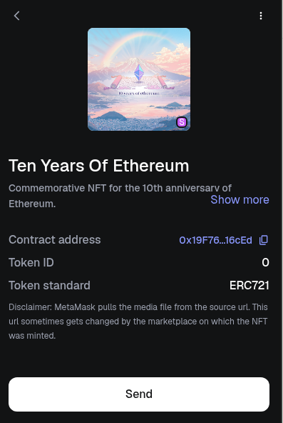

# 10-Years-of-Ethereum-NFT

Couldnt mint the 10 Years of ETH NFT so, I made my own (currently on Sepolia Testnet)

Mint your own using the command:

```
forge script script/Interact.s.sol --rpc-url <your RPC url> --private-key <your private key> --broadcast
```

Here's how it looks:

